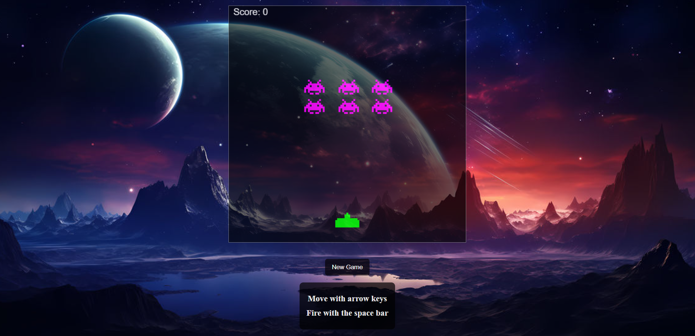

# Space Invasion rework 2026



**Space Invasion** is a simple, fast‑paced 2‑D shooter built with .NET.
You pilot a lone starfighter along the bottom of the screen and fend
off wave after wave of alien invaders.  The goal is to survive as long
as possible while racking up the highest score.

---

## Table of Contents

- [Space Invasion rework 2026](#spaceinvasion-rework-2026)
  - [Table of Contents](#table-of-contents)
  - [About](#about)
  - [Features](#features)
  - [Getting Started](#getting-started)
    - [Prerequisites](#prerequisites)
    - [Build \& Run](#build--run)

---

## About

Space Invasion is a learning project that demonstrates basic game
loop mechanics, sprite rendering, input handling and simple collision
detection in C#.  It was created to provide a lightweight base for
students to experiment with gameplay ideas.

---

## Features

* Player ship with smooth left/right movement and shooting.
* Multiple invader types with descending formations.
* Score tracking, lives and simple game‑over screen.
* Keyboard input (arrow keys, space) plus optional gamepad support.
* Extensible codebase – add new enemies, power‑ups or levels easily.
* Assets stored in `images/` for easy modification.

---

## Getting Started

### Prerequisites

* [.NET 6 SDK](https://dotnet.microsoft.com/download) or later.
* Visual Studio Code (recommended) or any C#‑capable editor.

### Build & Run

1. Clone the repo:

   ```powershell
   git clone https://github.com/your‑user/SpaceInvasion.git
   cd SpaceInvasion\invaders